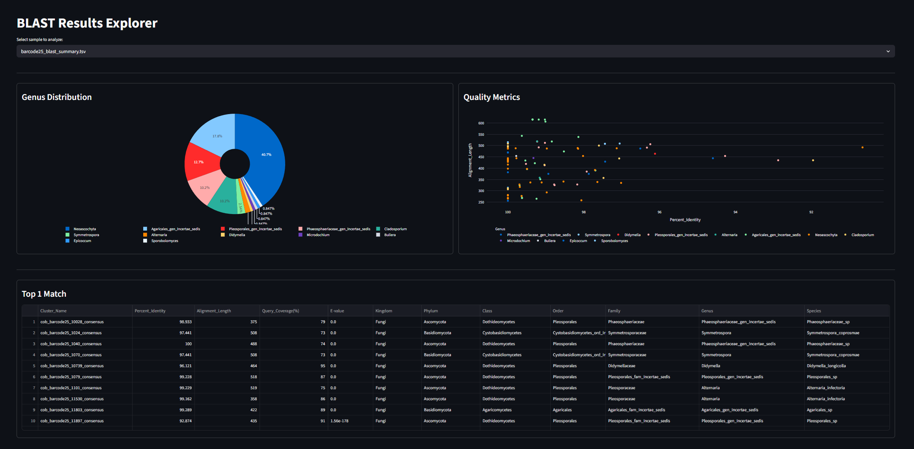
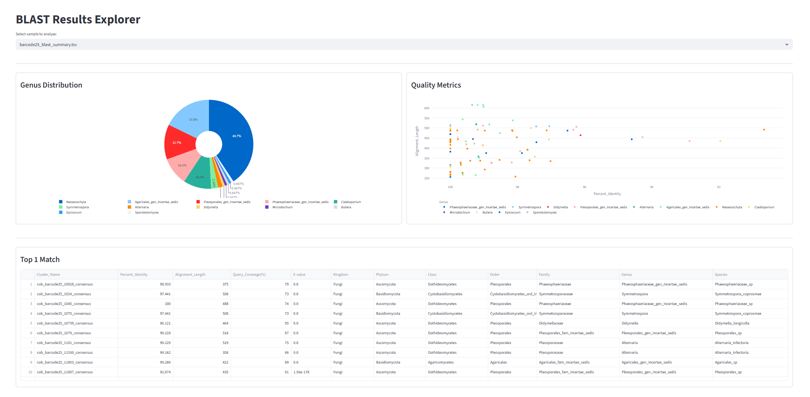
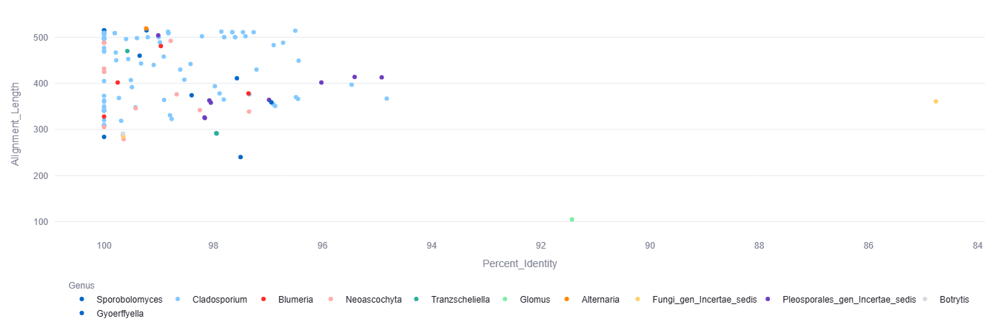
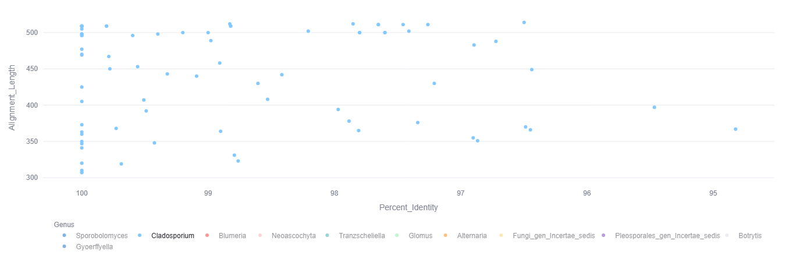
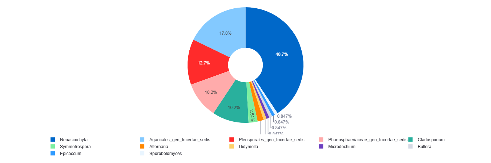

# Fungal ITS Analysis Pipeline (Nanopore)

An automated system for processing raw Nanopore sequencing reads, generating high-quality consensus sequences, and performing precise taxonomic identification using the UNITE reference database. The project includes an interactive dashboard for visualizing and analyzing the results.

## Prerequisites
* **Docker Desktop** (with WSL 2 backend).
* **WSL 2 Optimization:** For stable performance during clustering, create a `.wslconfig` file in your Windows user profile folder (`%USERPROFILE%\.wslconfig`) with the following settings:
  ```ini
  [wsl2]
  memory=8GB
  processors=6
  swap=8GB
  ```

## Project Structure

According to the current configuration, the project uses the following directory layout:

```text
FungiFlow/
├── .gitignore                  # File excluding large data from the GitHub repository
├── Dockerfile                  # Container image definition (biotools + Python/Streamlit)
├── ITS_list.txt                # Auxiliary reference list
├── database/                   # UNITE databases, BLAST indices (unite_blast_db), and Kraken2
│   └── .gitkeep                # Keeps the empty directory in Git
├── raw_data/                   # Input .fastq.gz files (e.g., barcode25.fastq.gz)
│   └── .gitkeep
├── assets/                     # Dashboard visualization images
│   ├── Blast_results_explorer_dark_theme.png
│   ├── Blast_results_explorer_light_theme.png
│   ├── Genus_distribution.png
│   ├── Quality_metrics_all.png
│   └── Quality_metrics_one.png
├── intermediate_data/          # Temporary folder for clusters and intermediate files
│   └── .gitkeep
├── tmp/                        # Temporary processing files
│   └── .gitkeep
├── scripts/                    # Execution and analysis scripts
│   ├── blast_app.py            # Streamlit app for results visualization
│   ├── process_all.sh          # Main data processing pipeline for all samples
│   ├── run_blast.sh            # Script for local BLAST identification
│   ├── unite_to_kraken.py      # UNITE to Kraken2 format converter
│   └── update_unite.sh         # Kraken2 database build/update script
├── blast_results/              # Identification results in .tsv format
│   └── .gitkeep
├── kraken_results/             # Kraken2 classification reports (separated by sample)
│   └── .gitkeep
└── consensus_results/          # Final FASTA sequences for each cluster
    └── .gitkeep
```

## User Guide

### 0. Download the UNITE Reference Database (Prerequisite)
For the system to recognize fungi, you must download the official ITS reference database. 
1. Go to the [UNITE repository](https://unite.ut.ee/repository.php).
2. Download the latest database in FASTA format (usually the "SH general release" package).
3. Extract the files and place the main database file (e.g., `sh_general_release_dynamic_19.02.2025.fasta`) in the `database/` folder.

### 1. Build the Environment
Build the Docker container (run this once or after making any changes to the Dockerfile):
```bash
docker build -t fungal_pipeline .
```

### 2. Prepare the Kraken2 Database (First time only)
Before the pipeline uses Kraken2 for initial classification, the UNITE database must be converted and built. Run the dedicated setup script:
```bash
docker run --rm -v ${PWD}:/data fungal_pipeline bash /data/scripts/update_unite.sh
```

### 3. Prepare the Local BLAST Database (First time only)
Build indices from the UNITE FASTA file for precise final alignment. Ensure this is run as a single continuous line in PowerShell:
```bash
docker run --rm -v ${PWD}:/data fungal_pipeline makeblastdb -in /data/database/sh_general_release_dynamic_19.02.2025.fasta -dbtype nucl -out /data/database/unite_blast_db
```

### 4. Raw Data Processing
Run the main pipeline for all samples located in the `raw_data/` folder. The script will perform adapter trimming (Porechop), length filtering (>300bp), clustering (CD-HIT at 98%), consensus assembly (SPOA), and initial taxonomy classification (Kraken2):
```bash
docker run --rm -v ${PWD}:/data fungal_pipeline bash /data/scripts/process_all.sh
```

### 5. BLAST Identification
Run the alignment of all generated consensuses against the UNITE database. The script will output ready-to-use `.tsv` tables in the `blast_results/` folder:
```bash
docker run --rm -v ${PWD}:/data fungal_pipeline bash /data/scripts/run_blast.sh
```

### 6. Launch the Dashboard (Analytical Visualization)
To launch the web application that automatically processes the tables and plots statistics, run the container with an open network port (8501):
```bash
docker run -it --rm -v ${PWD}:/data -p 8501:8501 fungal_pipeline streamlit run /data/scripts/blast_app.py
```
The application will be accessible in your web browser at: **http://localhost:8501**

## Performance Tips
* **OneDrive:** Always **pause OneDrive syncing** during analysis to prevent file locking and significant performance drops.
* **Resources:** Ensure your WSL2 `.wslconfig` limits are properly configured to prevent memory crashes during clustering.

## Key Metrics in the Dashboard
* **Percent Identity (pident):** Indicates taxonomic certainty (assumed thresholds: species >97%, genus >90%).
* **E-value:** Statistical significance of the match (the closer to zero, the more reliable the result).
* **Top 1 Hit:** Cleaned and parsed UNITE taxonomy (from Kingdom to Species) for the best match of each cluster.

---

## Dashboard Previews

### BLAST Results Explorer



### Quality Metrics & Taxonomy Distribution


