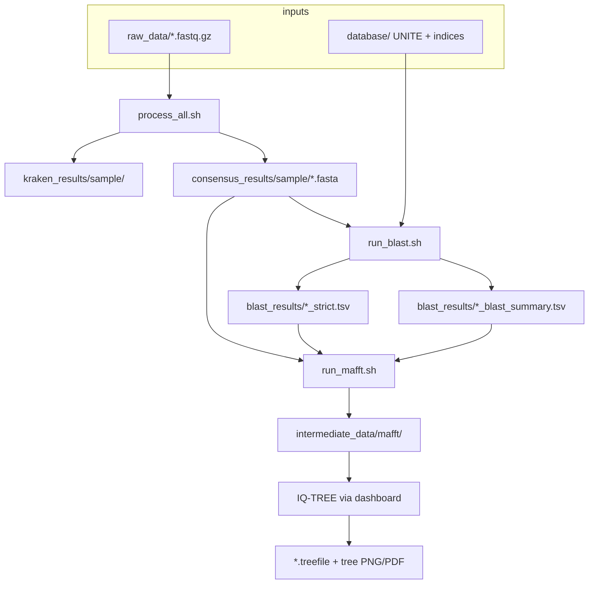
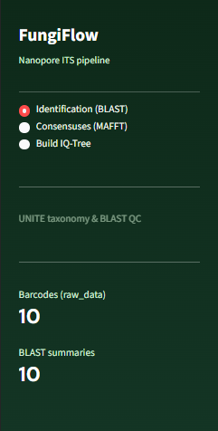
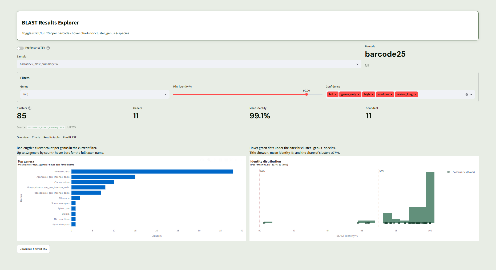
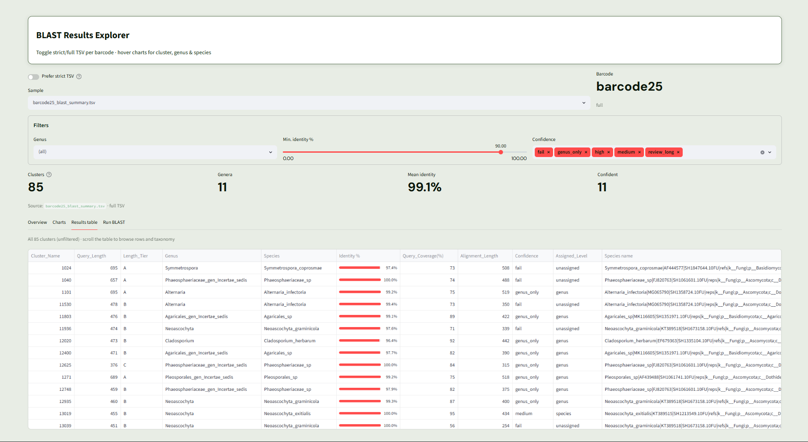
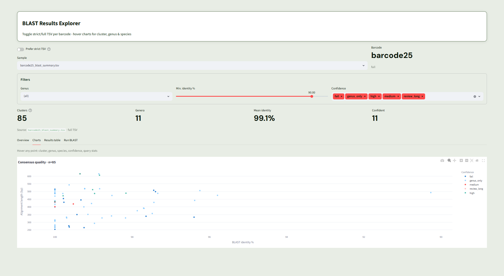
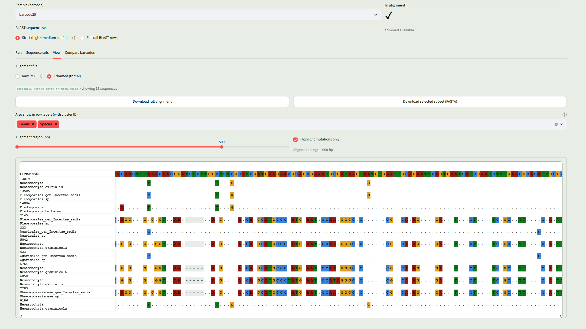
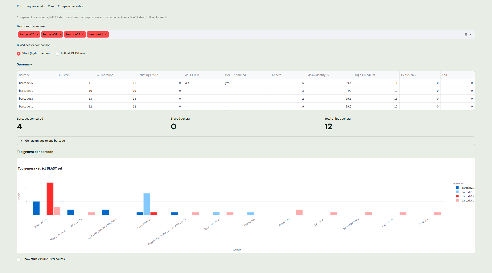
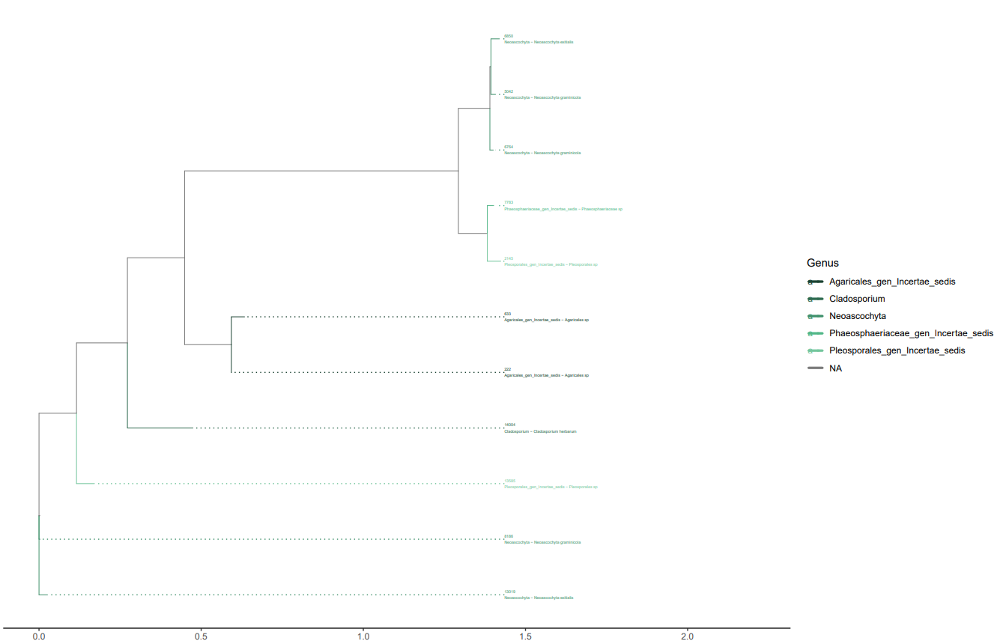
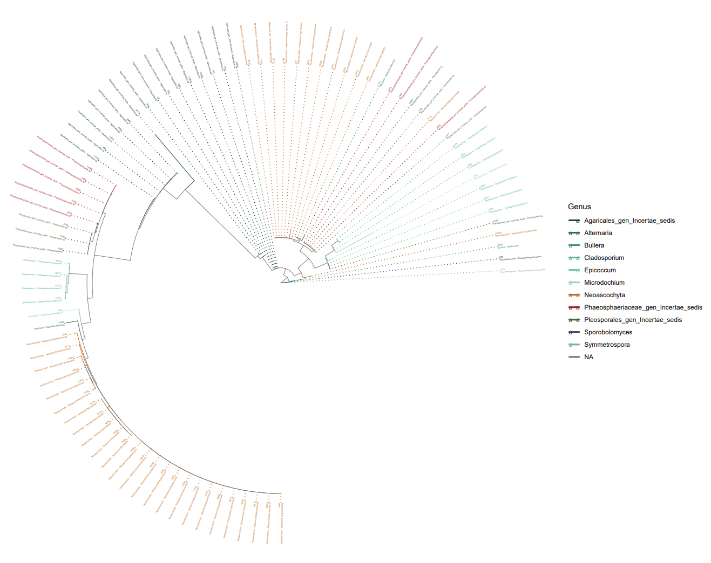

# FungiFlow

**FungiFlow** is an end-to-end pipeline for **Nanopore fungal ITS** sequencing: from raw FASTQ reads to consensus clusters, UNITE-based BLAST identification, multiple-sequence alignment (MAFFT), and maximum-likelihood phylogenies (IQ-TREE)—with an interactive **Streamlit** dashboard to explore and run each stage.

- **Read processing:** adapter trimming (Porechop), length filtering, clustering (CD-HIT 98%), consensus assembly (SPOA), Kraken2 screening  
- **Identification:** local BLAST against UNITE with **full** and **strict** result tables per barcode  
- **Alignment:** MAFFT on BLAST-selected cluster sets (strict or full), optional trimAl  
- **Phylogeny:** IQ-TREE with **ggtree** plots (rectangular and fan-style circular), genus-colored branches and taxonomy-aware tip labels  

---

## Table of contents

- [Pipeline overview](#pipeline-overview)
- [Quick start](#quick-start)
- [Prerequisites](#prerequisites)
- [Project structure](#project-structure)
- [Setup (first time)](#setup-first-time)
- [Command-line workflow](#command-line-workflow)
- [Dashboard guide](#dashboard-guide)
- [Outputs and file naming](#outputs-and-file-naming)
- [BLAST confidence tiers](#blast-confidence-tiers)
- [Configuration](#configuration)
- [Troubleshooting](#troubleshooting)
- [Screenshots](#screenshots)
- [Citation and references](#citation-and-references)

---

## Pipeline overview



| Stage | Script / module | Main tools |
|--------|------------------|------------|
| 1. Preprocess & cluster | `process_all.sh` | Porechop, seqtk, CD-HIT, SPOA, Kraken2 |
| 2. BLAST | `run_blast.sh` | BLAST+ (`blastn`) |
| 3. Alignment | `run_mafft.sh` | MAFFT, trimAl |
| 4. Phylogeny | Dashboard → **Build IQ-Tree** | trimAl, IQ-TREE, R/ggtree |
| Explore | Dashboard → **Identification**, **Consensuses** | Streamlit, Plotly, pandas |

---

## Quick start

Assumes **Docker Desktop** (WSL 2 backend) and a UNITE release in `database/`.

```bash
git clone https://github.com/gabost10297/FungiFlow.git
cd FungiFlow

# 1. Build image (once)
docker build -t fungal_pipeline .

# 2. Kraken2 DB from UNITE archive (once) — place *.tgz in database/
docker run --rm -v ${PWD}:/data fungal_pipeline bash /data/scripts/update_unite.sh

# 3. BLAST index (once) — uses first *.fasta in database/
docker run --rm -v ${PWD}:/data fungal_pipeline bash -c \
  'FASTA=$(ls /data/database/*.fasta 2>/dev/null | head -1) && \
   test -n "$FASTA" && makeblastdb -in "$FASTA" -dbtype nucl -out /data/database/unite_blast_db'

# 4. Put barcode25.fastq.gz (etc.) in raw_data/, then process + BLAST
docker run --rm -v ${PWD}:/data fungal_pipeline bash /data/scripts/process_all.sh
docker run --rm -v ${PWD}:/data fungal_pipeline bash /data/scripts/run_blast.sh

# 5. Launch dashboard
docker run -it --rm -v ${PWD}:/data -p 8501:8501 fungal_pipeline \
  streamlit run /data/scripts/app.py
```

Open **http://localhost:8501** and use the sidebar to switch modules.

---

## Prerequisites

### Docker and WSL 2

- **Docker Desktop** with the **WSL 2** integration enabled.  
- Mount the project directory with `-v ${PWD}:/data` (paths inside containers always use `/data/...`).

### WSL memory (recommended)

For stable clustering on larger runs, create `%USERPROFILE%\.wslconfig`:

```ini
[wsl2]
memory=16GB
processors=6
swap=16GB
```

Restart WSL after editing (`wsl --shutdown` in PowerShell).

### Disk and data

- **UNITE** release (FASTA or `.tgz` for Kraken build).  
- **BLAST** and **Kraken** indices under `database/` (generated locally; not in Git).  
- **Raw FASTQ** in `raw_data/`; results land in `consensus_results/`, `blast_results/`, etc. (see [.gitignore](.gitignore)—only `.gitkeep` files are tracked).

### Windows tips

- **Pause OneDrive** while running Docker jobs to avoid file locks and slow I/O.  
- If `git pull` fails on `intermediate_data/.gitkeep` with *Permission denied*, Docker may have created that folder as **root**. From PowerShell: `wsl -u root`, then `chown -R YOUR_USER:YOUR_USER /home/YOUR_USER/path/to/FungiFlow/intermediate_data`.

---

## Project structure

```text
FungiFlow/
├── Dockerfile                  # Conda bio tools + Streamlit + R/ggtree
├── README.md
├── ITS_list.txt                # Auxiliary ITS reference list
├── css/
│   └── style.css               # Dashboard theme
├── assets/                     # README screenshots (not used at runtime)
├── database/                   # UNITE data, Kraken DB, unite_blast_db.*
├── raw_data/                   # Input *.fastq.gz per barcode
├── consensus_results/          # Per-sample cluster consensus FASTA
│   └── {barcode}/*.fasta
├── blast_results/              # BLAST TSV tables per sample
├── kraken_results/             # Kraken2 reports per sample
├── intermediate_data/          # Pipeline temp; mafft/; IQ-TREE outputs
├── tmp/
└── scripts/
    ├── app.py                  # Main Streamlit entry (use this to launch)
    ├── blast_app.py            # Identification (BLAST) module
    ├── mafft_app.py            # MAFFT module
    ├── iqtree_app.py           # IQ-TREE module
    ├── plot_tree.R             # ggtree rectangular + fan circular plots
    ├── process_all.sh          # Batch Nanopore → consensus + Kraken
    ├── master_pipeline.sh      # Single-sample test pipeline (barcode25)
    ├── run_blast.sh            # Tiered BLAST + strict export
    ├── run_mafft.sh            # MAFFT from BLAST TSVs + trimAl
    ├── update_unite.sh         # UNITE archive → Kraken2 DB
    └── unite_to_kraken.py      # UNITE FASTA → Kraken taxonomy files
```

**Git tracking:** large data directories are ignored except `.gitkeep` placeholders so empty folders exist after clone.

---

## Setup (first time)

### 0. Download UNITE

1. Visit the [UNITE download page](https://unite.ut.ee/repository.php).  
2. Download the latest **general FASTA** release (e.g. SH dynamic release).  
3. Either:
   - Place the **`.tgz` / `.tar.gz`** archive in `database/` for `update_unite.sh`, or  
   - Extract the **`.fasta`** into `database/` for `makeblastdb`.

### 1. Build the Docker image

```bash
docker build -t fungal_pipeline .
```

Included tools (via Conda): `porechop_abi`, `cd-hit`, `spoa`, `kraken2`, `mafft`, `trimal`, `iqtree`, `r-base`, `bioconductor-ggtree`, and Python packages `streamlit`, `pandas`, `plotly`.

### 2. Build the Kraken2 database

With a UNITE archive in `database/`:

```bash
docker run --rm -v ${PWD}:/data fungal_pipeline bash /data/scripts/update_unite.sh
```

This extracts the archive, runs `unite_to_kraken.py`, and executes `kraken2-build`. Existing Kraken files in `database/` may be removed during the build.

### 3. Build the BLAST database

```bash
docker run --rm -v ${PWD}:/data fungal_pipeline bash -c \
  'FASTA=$(ls /data/database/*.fasta | head -1) && \
   echo "Using $FASTA" && \
   makeblastdb -in "$FASTA" -dbtype nucl -out /data/database/unite_blast_db'
```

Expect files such as `database/unite_blast_db.nhr`, `.nin`, `.nsq`.

---

## Command-line workflow

### Step 1 — Process raw reads (`process_all.sh`)

For every `raw_data/*.fastq.gz`:

1. Adapter trimming (Porechop)  
2. FASTA conversion; discard reads **&lt; 300 bp**  
3. Clustering (**CD-HIT** at 98% identity)  
4. Consensus per cluster (**SPOA**; clusters with **≥ 20** reads)  
5. **Kraken2** on trimmed reads  
6. Cleanup of per-sample temp files under `intermediate_data/`

```bash
docker run --rm -v ${PWD}:/data fungal_pipeline bash /data/scripts/process_all.sh
```

Samples already present under `kraken_results/{sample}/` are **skipped**.

**Single-sample test:** edit `SAMPLE` in `scripts/master_pipeline.sh`, then:

```bash
docker run --rm -v ${PWD}:/data fungal_pipeline bash /data/scripts/master_pipeline.sh
```

### Step 2 — BLAST identification (`run_blast.sh`)

Aligns each consensus in `consensus_results/{sample}/` to `database/unite_blast_db`.

```bash
docker run --rm -v ${PWD}:/data fungal_pipeline bash /data/scripts/run_blast.sh
```

**Per sample** it writes:

| File | Content |
|------|---------|
| `{sample}_blast_summary.tsv` | All clusters with QC fields |
| `{sample}_blast_summary_strict.tsv` | Subset with `Confidence` = `high` or `medium` |

See [BLAST confidence tiers](#blast-confidence-tiers) for column meanings and rules.

### Step 3 — MAFFT alignment (`run_mafft.sh`)

Builds alignments from cluster names listed in each BLAST TSV (pulls FASTA from `consensus_results/`).

```bash
# All samples, strict + full (default)
docker run --rm -v ${PWD}:/data fungal_pipeline bash /data/scripts/run_mafft.sh

# One barcode, strict only
docker run --rm -v ${PWD}:/data fungal_pipeline bash /data/scripts/run_mafft.sh barcode25 strict

# All samples, full TSV only
docker run --rm -v ${PWD}:/data fungal_pipeline bash /data/scripts/run_mafft.sh --all full
```

**Outputs** (per sample and mode):

- `intermediate_data/mafft/{sample}_{strict|full}_mafft.fasta`  
- `intermediate_data/mafft/{sample}_{strict|full}_mafft_trimmed.fasta` (if trimAl enabled)  
- `intermediate_data/mafft/manifest.tsv` — index of runs  

**MAFFT strategy** (by sequence count): ≤200 `--auto`; ≤1000 fast progressive; &gt;1000 `--parttree`. Requires **≥ 2** sequences.

### Step 4 — IQ-TREE (dashboard recommended)

Phylogenetic runs are started from **Build IQ-Tree → Generate** (trimAl + IQ-TREE in the background). See [Dashboard guide](#dashboard-guide).

---

## Dashboard guide

### Launch

Always start the **main app** (not `blast_app.py` alone):

```bash
docker run -it --rm -v ${PWD}:/data -p 8501:8501 fungal_pipeline \
  streamlit run /data/scripts/app.py
```

The sidebar lists three modules and shows counts for **barcodes in raw_data** and **BLAST summaries**.

---

### Module 1 — Identification (BLAST)

**Purpose:** Explore BLAST tables, filter by taxonomy and quality, run BLAST from the UI.

**Controls:**

- **Prefer strict TSV** — switches between `*_blast_summary_strict.tsv` and `*_blast_summary.tsv` for the same barcode.  
- **Sample** — select barcode.  
- **Filters** — genus, minimum identity %, confidence levels.  

**Tabs:**

| Tab | Description |
|-----|-------------|
| **Overview** | Genus bar chart and identity histogram (Plotly); download filtered TSV |
| **Charts** | Identity vs alignment length scatter with hover metadata |
| **Results table** | Full scrollable table (all clusters, unfiltered) |
| **Run BLAST** | Executes `run_blast.sh` on all samples in `consensus_results/` |

**Parsed taxonomy:** `Species_Name` (UNITE-style) is split into Kingdom → Species columns for charts and filters.

---

### Module 2 — Consensuses (MAFFT)

**Purpose:** Run and inspect alignments built from BLAST cluster sets.

**Top bar:**

- **Sample (barcode)**  
- **BLAST sequence set** — *Strict* (high + medium) or *Full* (all rows)  

**Tabs:**

| Tab | Description |
|-----|-------------|
| **Run** | Launch `run_mafft.sh` for selected sample/mode; view log tail |
| **Sequence sets** | Browse/select clusters included in the alignment |
| **View** | Interactive alignment viewer (raw MAFFT or trimAl-trimmed); labels show cluster + genus/species |
| **Compare barcodes** | Cross-sample genus overlap and charts |

---

### Module 3 — Build IQ-Tree

**Purpose:** Generate and view ML trees from MAFFT alignments.

**Tabs:**

| Tab | Description |
|-----|-------------|
| **Tree explorer** | Pick an existing `.treefile`; rectangular or circular layout; download Newick / PNG / PDF |
| **Generate** | New IQ-TREE run |

**Generate — recommended path:** *Single sample (BLAST + MAFFT)*

1. Choose **barcode** and **strict** or **full** set.  
2. Set **run name** (suffix for output files).  
3. Configure **MFP** or **HKY+F+R5**, **UFBoot** replicates, **SH-aLRT**.  
4. **Run trimAl + IQ-TREE** — runs MAFFT first if needed; requires **≥ 3** sequences.

**Output basename pattern:**

`sample_{barcode}_{strict|full}_{run_name}_trimmed.fasta.*`

**Tree plots** (`plot_tree.R`):

- **Rectangular** — `*_tree_rect.png` / `.pdf`  
- **Circular** — fan layout (`layout = "fan"`, ~¾ circle with gap), genus-colored branches, multiline tip labels (cluster + genus/species) → `*_tree_circ.png` / `.pdf`  

Use **Regenerate both layouts** after updating the R script or tree file.

---

## Outputs and file naming

| Location | Pattern | Produced by |
|----------|---------|-------------|
| `consensus_results/{sample}/` | `{cluster}.fasta` | `process_all.sh` |
| `blast_results/` | `{sample}_blast_summary.tsv` | `run_blast.sh` |
| `blast_results/` | `{sample}_blast_summary_strict.tsv` | `run_blast.sh` |
| `kraken_results/{sample}/` | `*_ITS_report.txt`, `*_kraken2.txt` | `process_all.sh` |
| `intermediate_data/mafft/` | `{sample}_{strict\|full}_mafft.fasta` | `run_mafft.sh` |
| `intermediate_data/mafft/` | `{sample}_{strict\|full}_mafft_trimmed.fasta` | `run_mafft.sh` + trimAl |
| `intermediate_data/mafft/` | `manifest.tsv` | `run_mafft.sh` |
| `intermediate_data/` | `sample_{barcode}_{strict\|full}_{run}_trimmed.fasta.treefile` | IQ-TREE |
| `intermediate_data/` | `*_tree_rect.png`, `*_tree_circ.png` | `plot_tree.R` |
| `intermediate_data/` | `{treefile}.tip_meta.csv` | IQ-TREE module (for R labels) |

---

## BLAST confidence tiers

### TSV columns (main table)

| Column | Description |
|--------|-------------|
| `Cluster_Name` | Cluster ID (matches consensus FASTA basename) |
| `Query_Length` | Consensus length (bp) |
| `Length_Tier` | A / B / C / D / LONG (see below) |
| `Reference_ID` | Best UNITE hit accession |
| `Percent_Identity` | Top hit identity (%) |
| `Alignment_Length` | Alignment length |
| `Query_Coverage(%)` | Query coverage |
| `E-value` | BLAST E-value |
| `Bitscore` | Bit score |
| `Top2_Pident_Gap` | Identity gap between 1st and 2nd hit (%) |
| `Species_Name` | Full UNITE title / taxonomy string |
| `Confidence` | `high`, `medium`, `low_species`, `genus_only`, `ambiguous`, `fail`, `review_long`, … |
| `Assigned_Level` | `species`, `genus`, `unassigned`, `manual_review` |

### Length tiers (query consensus)

| Tier | Length (bp) | Notes |
|------|-------------|--------|
| **A** | 400–900 | Standard species-level rules |
| **B** | 350–&lt;400 | Stricter identity thresholds |
| **C** | 300–&lt;350 | Very strict |
| **D** | &lt;300 | Species calls downgraded toward genus |
| **LONG** | &gt;900 | Flagged for manual review |

### Strict table

`{sample}_blast_summary_strict.tsv` contains only rows where `Confidence` is **`high`** or **`medium`**.

Rules are implemented in `scripts/run_blast.sh` (identity, coverage, alignment length, top-2 gap). Use strict sets for MAFFT/IQ-TREE when you want higher-confidence cluster sets.

### Interpreting identity (rule of thumb)

- **Species-level ITS:** often **≥ 97–99%** identity (depends on tier and coverage).  
- **Genus-level:** broader hits (~**≥ 90%** with coverage filters).  
- **E-value:** lower is better; pipeline uses **≤ 1e-20** for initial hit retention.

---

## Configuration

Environment variables (optional, inside `docker run -e ...`):

| Variable | Default | Used by |
|----------|---------|---------|
| `BLAST_THREADS` | `10` | `run_blast.sh` |
| `MAFFT_THREADS` | `4` (or `BLAST_THREADS`) | `run_mafft.sh` |
| `RUN_TRIMAL` | `1` | `run_mafft.sh` (set `0` to skip trimAl) |
| `IQTREE_THREADS` | `AUTO` | IQ-TREE via dashboard |

Example:

```bash
docker run --rm -e BLAST_THREADS=16 -e MAFFT_THREADS=8 -v ${PWD}:/data fungal_pipeline \
  bash /data/scripts/run_blast.sh
```

---

## Troubleshooting

| Problem | What to try |
|---------|-------------|
| `Permission denied` on `intermediate_data/.gitkeep` | Docker created folder as root; fix ownership (`wsl -u root` → `chown`) or remove folder and `git pull` again |
| BLAST finds no hits | Confirm `database/unite_blast_db.*` exists; rerun `makeblastdb` |
| MAFFT skipped | Fewer than 2 clusters in TSV; run BLAST first; check cluster FASTA names match TSV |
| IQ-TREE: need ≥3 sequences | Add clusters or use **full** BLAST set |
| Empty charts / no genus | Open a TSV that has `Species_Name`; taxonomy is parsed on load |
| Circular tree looks like a full ring | Click **Regenerate both layouts**; ensure `plot_tree.R` uses fan layout |
| R / ggtree error in tree view | Rebuild Docker image; check stderr in the UI; verify Bioconductor packages installed |
| Sample skipped in `process_all.sh` | Delete `kraken_results/{sample}/` to force reprocessing |
| Slow / locked files on Windows | Pause OneDrive; increase WSL memory in `.wslconfig` |

---

## Screenshots

Replace the placeholder images below with your own captures from the current dashboard. Suggested filenames keep paths stable in Git.

### How to capture

1. Run the dashboard (`streamlit run /data/scripts/app.py`).  
2. Use **light or dark** OS theme consistently across shots.  
3. Crop to the **main content area** (sidebar optional but recommended for the first shot).  
4. Save PNGs under `assets/` with the names in the table.  
5. Commit updated images when the UI changes.

### Screenshot checklist

| # | File to save | What to show | Paste in README section |
|---|----------------|--------------|-------------------------|
| 1 | `assets/01_dashboard_sidebar.png` | Full window: sidebar with **FungiFlow** brand, three modules, metrics (barcodes / BLAST summaries) | [Dashboard overview](#dashboard-overview) |
| 2 | `assets/02_blast_overview.png` | **Identification** → **Overview** tab: genus bar + identity histogram, strict toggle visible | [BLAST module](#blast-module) |
| 3 | `assets/03_blast_results_table.png` | **Results table** tab: scrollable cluster table with taxonomy columns | [BLAST module](#blast-module) |
| 4 | `assets/04_blast_charts.png` | **Charts** tab: identity vs alignment length scatter | [BLAST module](#blast-module) (optional second figure) |
| 5 | `assets/05_mafft_view.png` | **Consensuses** → **View** tab: alignment with cluster/genus labels | [MAFFT module](#mafft-module) |
| 6 | `assets/06_mafft_compare.png` | **Compare barcodes** tab: genus overlap / comparison charts | [MAFFT module](#mafft-module) |
| 7 | `assets/07_iqtree_rectangular.png` | **Build IQ-Tree** → **Tree explorer** → **Rectangular** layout | [IQ-TREE module](#iq-tree-module) |
| 8 | `assets/08_iqtree_circular_fan.png` | **Tree explorer** → **Circular** (fan arc with gap, colored tips) | [IQ-TREE module](#iq-tree-module) |

---

### Dashboard overview

<!-- SCREENSHOT 1: assets/01_dashboard_sidebar.png -->


*Caption: Main entry point—switch between Identification, MAFFT, and IQ-TREE from the sidebar.*

---

### BLAST module

<!-- SCREENSHOT 2: assets/02_blast_overview.png -->


*Caption: Overview charts with strict/full toggle and filters applied.*

<!-- SCREENSHOT 3: assets/03_blast_results_table.png -->


*Caption: Full results table with cluster metadata and UNITE hit strings.*

<!-- SCREENSHOT 4 (optional): assets/04_blast_charts.png -->


*Caption: Identity vs alignment length; hover shows cluster, genus, and species.*

---

### MAFFT module

<!-- SCREENSHOT 5: assets/05_mafft_view.png -->


*Caption: Alignment view with taxonomy-aware row labels (strict or full set).*

<!-- SCREENSHOT 6: assets/06_mafft_compare.png -->


*Caption: Cross-barcode comparison of genus composition.*

---

### IQ-TREE module

<!-- SCREENSHOT 7: assets/07_iqtree_rectangular.png -->


*Caption: Rectangular ggtree plot with genus-colored branches and tip labels.*

<!-- SCREENSHOT 8: assets/08_iqtree_circular_fan.png -->


*Caption: Circular fan layout (~¾ arc) with genus colors and multiline tip labels.*

---

## Citation and references

If you use this pipeline, please cite the underlying tools and databases:

- **UNITE:** [UNITE Community](https://unite.ut.ee/)  
- **BLAST+:** Altschul et al., NCBI BLAST  
- **Kraken2:** Wood et al.  
- **MAFFT:** Katoh & Standley  
- **IQ-TREE:** Nguyen et al.  
- **ggtree:** Yu et al., *Methods in Ecology and Evolution*  
